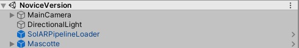
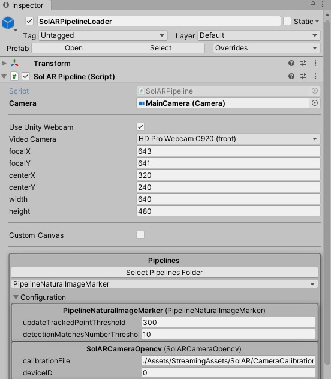

# SolARUnityPlugin

A Unity plugin allowing to load **SolAR pipelines**.  
:warning: We recommend to use **Unity Version 2019.3.3f1 (LTS)**

Currently available pipelines are : 

| Samples | Description |
| --- | --- |
| [Pipeline Fiducial](https://github.com/SolarFramework/FiducialMarker) | The SolAR Fiducial Image Marker sample shows a SolAR pipeline for augmented reality based on a fiducials markers image. |
| [Pipeline Natural Image](https://github.com/SolarFramework/NaturalImageMarker)| The SolAR Natural Image Marker sample shows a SolAR pipeline for augmented reality based on a natural image.|
| [Pipeline SLAM](https://github.com/SolarFramework/Sample-Slam)| Show a SolAR pipeline for augmented reality based on a SLAM (Simultaneous Localization And Mapping).|

You can find **SolAR Unity Sample application** built (`*.exe`/`*.app`/`*.apk`) in [SolarFramework/SolARUnitySamples](https://github.com/SolarFramework/SolARUnitySamples/releases).

SolARUnityPlugin offer two mods : 
* **Novice**
    We give you Pipelines (DLL) directly from our C++ SolAR framework.

 * ~~Expert
    We give you the opportunity to modify and create your pipeline in C# directly in Unity. (Wrapping of our SolAR C++ framework)~~.

More details on [http://solarframework.org/use/unity](https://solarframework.github.io/use/unity/).

## How to run

* Import **Unity Package** from our Github [SolarFramework/SolARUnityPlugin](https://github.com/SolarFramework/SolARUnityPlugin/releases). 

* In Unity Editor open the Novice scene `./Assets/SolAR/Scenes/NoviceVersion.unity`.

* This scene includes **SolARPipelineLoader** prefab and a **3D model**.
  

* Your 3D model should be tagged to `SolARObject`

* Then you just have to choose the pipeline to use in the inspector of your **SolARPipelineLoader**. You can directly edit parameters of your pipeline (in this case `PipelineNaturalImageMarker.xml`) from the inspector.

* Click on Unity Editor `Play` button or build the application

:information_source: You can find all of this workflow in video, watch [SolAR Framework Overview](https://solarframework.github.io/) (timecode 2min20).

## How to build with pre-compiled 
* Install [Remaken](https://github.com/b-com-software-basis/remaken) (a meta dependencies management tool).

* Download [Swig](http://www.swig.org/) (use for wrapping), unzip archive and add an environment variable to `Path` for the `swig.exe`. 

* Open a terminal and execute `Install.bat` to download module, wrap to C# and import DLLs in Unity.

* Every module should be imported in `./Assets/Plugins` and wrapped C# in `./Assets/SolAR/Swig`.

* For SLAM add the [fbow vocabularies](https://github.com/SolarFramework/binaries/releases/download/fbow%2F0.0.1%2Fwin/fbow_voc.zip) unzip this archive and put the `akaze.fbow` in your `./Assets/StreamingAssets/SolAR/FBOW`.
## How to build with source

1° Build    **[xpcf](https://github.com/b-com-software-basis/xpcf/)**
            & **SolARFramework**.
            
2° Execute  the file `./core/SolARFramework/SolARWrapper/_build.bat`.

3° Build    **SolARWrapper**
            & **SolARPipelineManager**.
            
4° Build    necessary module (OpenCV, Tools, FBOW... depending on pipelines you want to use).

5° Build    Pipelines (Fiducial, Natural Image, SLAM ...) :exclamation: as **[plugin](https://solarframework.github.io/assemble/unity_pipeline/)** :exclamation:.

6° Execute `Bundle.bat` to import libraries and modules in your `./Assets/Plugins` and C# wrapped in your Unity project `./Assets/SolAR/Swig`.

7° For SLAM add the [fbow vocabularies](https://github.com/SolarFramework/binaries/releases/download/fbow%2F0.0.1%2Fwin/fbow_voc.zip) unzip this archive and put the `akaze.fbow` in your `./Assets/StreamingAssets/SolAR/FBOW`.

## We follow this hierarchy (Unity) (only folders)

    Assets
    ==> Objects                (3D models)
                
    ==> Plugins                (Our DLLs)
    
    ==> Scenes                 (Samples Scenes)
    
    ==> SolAR                  (everything else)
        --> Editor             (scripts User Interface in Editor)
        
        --> Materials          (our Unity Materials)
        
        --> Pipelines          (our pipelines descriptions - Novice version only)
        
        --> Scripts            (all our scripts Novice and Expert version)
        
            *NoviceVersion
            
            *ExpertVersion
               
        --> Shaders             (our shaders)
        
        
    ==> StreamingAssets
        -->Android              (files relative to Android support)
        -->CameraCalibration    (our calibration files)
        -->FBOW                 (include .fbow)
        -->Markers              (our markers)
        -->Pipelines            (our .xml files to configure our pipelines)

## Contact 
Website https://solarframework.github.io/

Contact framework.solar@b-com.com

